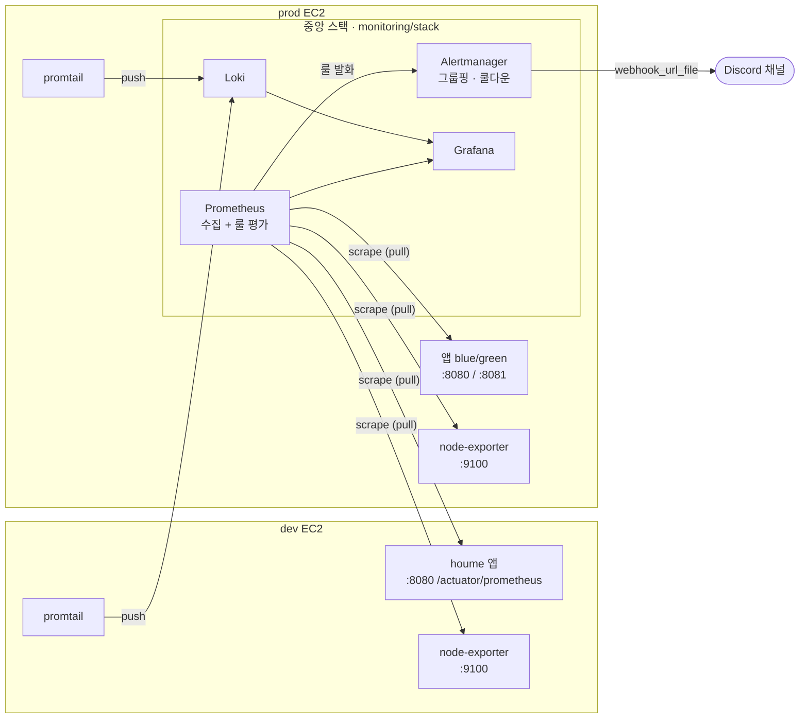
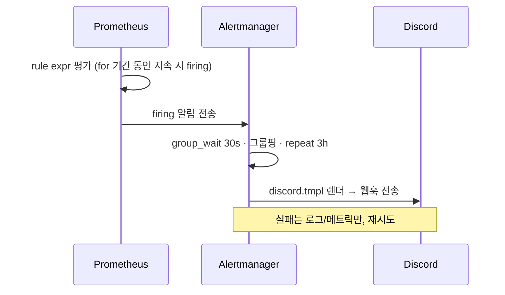
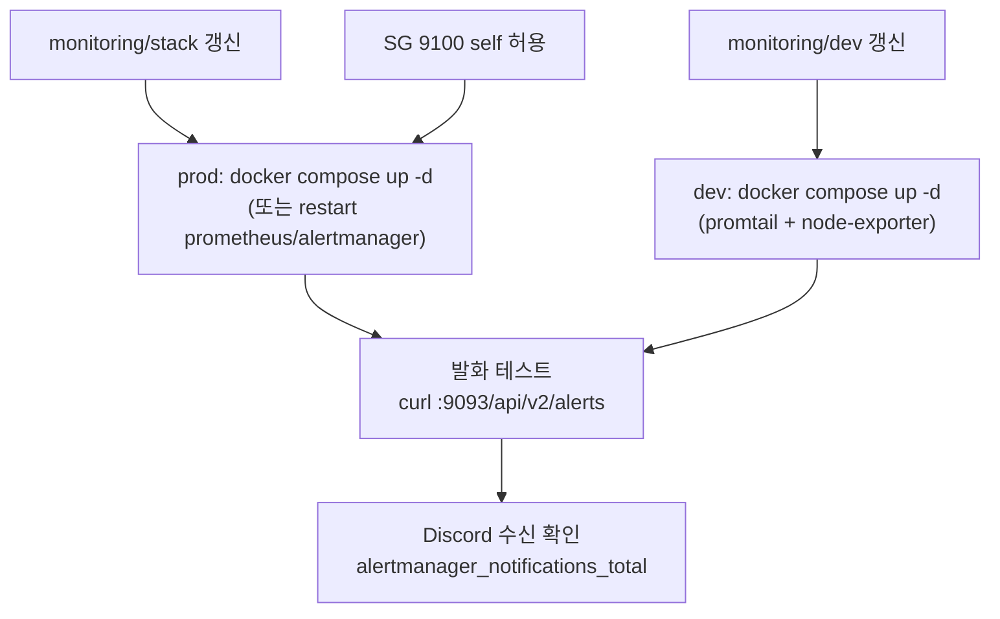

# Prometheus 알림 아키텍처 (Alertmanager → Discord)

서버 다운·자원 포화·JVM Heap 이상 등 **인프라 레벨 이상**을 Prometheus 룰로 감지해 Discord 로 알린다.
앱 예외 알림(`ErrorAlertNotifier`, 5xx)·Sentry(개별 예외)와 역할이 다르다 — 이건 "지표 임계치" 알림이다.

## 전체 구조



- **수집은 pull**: 중앙 Prometheus 가 각 대상의 엔드포인트를 긁어온다 (대상이 "던지는" 게 아니다).
- **로그는 push**: promtail 이 각 호스트 로그를 중앙 Loki 로 밀어 보낸다.
- **중앙집중**: 알림 두뇌(Prometheus + Alertmanager)는 **prod 한 곳**. dev 는 감시 *대상*이며,
  dev 앱/호스트 이상도 prod 스택이 감지해 알린다 (dev 에 별도 alertmanager 없음).

## 알림 발화 흐름



## 스크랩 대상 (`prometheus.yml`)

| job | 대상 | 내용 |
|---|---|---|
| `houme-prod` | `172.17.0.1:8080, :8081` | prod 앱 blue/green |
| `houme-dev` | `10.0.1.217:8080` | dev 앱 |
| `node-exporter` (env=prod) | `node-exporter:9100` | prod 호스트 자원 |
| `node-exporter` (env=dev) | `10.0.1.217:9100` | dev 호스트 자원 |

> dev `9100` 스크랩을 위해 SG(`sg-0e59...`)에 9100 을 **같은 SG(모니터링 호스트)로부터만** 허용한다.

## 알림 룰 (`rules/houme-alerts.yml`)

| alert | 조건 | 심각도 | 평가 단위 |
|---|---|---|---|
| `HoumeAppDown` | job 의 모든 인스턴스 `up<1` 2분 | critical | job (blue/green standby 오탐 방지) |
| `HoumeHighJvmHeap` | Heap 사용률 > 80% 3분 | warning | instance |
| `HighHostCpuUsage` | CPU > 80% 5분 | warning | **instance** (prod/dev 분리) |
| `HighHostDiskUsage` | 루트 디스크 > 85% 5분 | warning | instance |

> 호스트 룰은 반드시 `by (instance)` 로 평가한다 — 그러지 않으면 prod·dev 지표가 하나로 뭉개진다.

## Discord 전송 (`alertmanager/`)

- `alertmanager.yml`: 단일 route → `discord` receiver (Alertmanager 네이티브 `discord_configs`).
- 웹훅은 **코드에 커밋하지 않는다** → `webhook_url_file: /etc/alertmanager/secrets/discord_webhook_url`.
  - `.gitignore` 처리, 서버에만 배치(chmod 600, owner 65534). **없으면 alertmanager 기동 실패.**
- 메시지 포맷: `templates/discord.tmpl` (title + 멀티라인 message).
- 그룹핑: `group_wait 30s` · `group_interval 5m` · `repeat_interval 3h` (도배 방지).

## 배포 (수동 — 앱 CD 와 별개)



```bash
# 중앙 스택 (prod EC2)
cd /home/ubuntu/monitoring/stack && docker compose up -d
# dev 에이전트 (dev EC2)  — promtail + node-exporter
cd /home/ubuntu/monitoring/dev && docker compose up -d

# 발화 테스트 (prod 호스트, 로컬 바인딩 9093)
curl -XPOST http://127.0.0.1:9093/api/v2/alerts -H 'Content-Type: application/json' \
  -d '[{"labels":{"alertname":"Test","service":"houme-api","severity":"warning","job":"manual"},
        "annotations":{"summary":"테스트","description":"연동 확인"}}]'
curl -s http://127.0.0.1:9093/metrics | grep alertmanager_notifications_total
```
